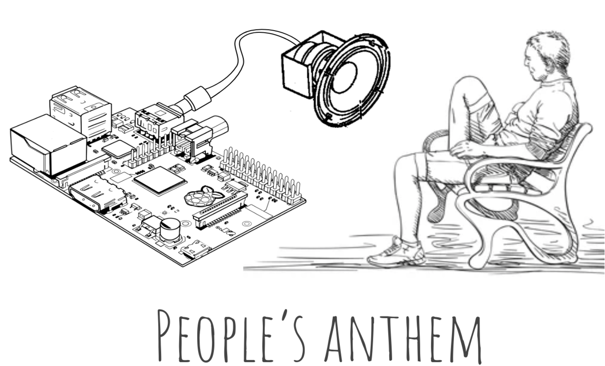

# People's Anthem


[](https://app.circleci.com/pipelines/github/alexantoinefortin/peoples-anthem)

A project using facial recognition and a raspberry pi's camera to identify a person and play their favorite music.

The project provides an easy to setup configuration, with Docker -- taking care of all dependencies, including pre-compiled `torch` wheels optimized for the raspberry pi.

## Requirements

* A [raspberry pi](https://www.raspberrypi.org/) (rpi)
* Docker installed on your OS ([how to install](https://docs.docker.com/engine/install/debian/))
* A [raspberry pi camera](https://www.raspberrypi.org/products/camera-module-v2/)
* A speaker plugged-in to the rpi via the audio jack
* A source of music (mp3 or a Spotify account) (More info [here](doc/setting-up-spotify.md))


## Install
To get started, you will need `docker` and an internet connection.
The installation might take up to 150 minutes on a rpi4.

```bash
git clone git@github.com:alexantoinefortin/peoples-anthem.git
cd peoples-anthem
make build-peoples-anthem
```

## Usage
In this section, we discuss how to:
1. Build a dataset of faces
2. Train a facial recognition algorithm
3. Use that model to recognize people and to play their Spotify playlist when they are recognized

### 1. Building a dataset of faces

#### 1.1 Choosing a location for your rpi
The first step is to place your rpi and rpi-camera at a place where it can recognize people.

#### 1.2 Running the code for recording the images of faces
```bash
make run-record-faces
```
The images will be saved, in this repository's directory, in: `./data/`.

Let the container run for as long as necesseray. Try collecting images at different time of the day and in different lighting conditions, etc.

To kill the container use: `docker kill peoples_anthem`.

#### 1.3 Creating a train/test set
Reorganize the images saved in `./data/` (see 1.2) according to the following directory structure:

```
./data/
├── train/
│   ├── alice/
│   ├── bob/
│   ├── misc/
├── test/
    ├── alice/
    ├── bob/
    ├── misc/
```

This means that you have to manually identify who is in these pictures and to put each pictures in the correctly named directory.

Note: To help the algorithm in identifying out-of-scope faces, the category _misc_, as seen above, should be added. This category should include images of:
* unrecognizable faces
* faces of people you do not want to recognize
* non-face items

### 2. Training a face recognition algorithm
Once step 1. is completed, run the model's training code:

```bash
make train-model
```

By default, the trained model will be saved in `./models/model.v1.pklz`.

The code will print the train/test accuracy.

As a guideline, during the development of this project, the model was trained to recognize 4 different persons + 1 _misc_ category. The model obtained an `accuracy_train=0.85` and an `accuracy_test=0.83`.

Try adjusting the model's hyperparameters in `./code/train_face_recognition.py`

### 3. Playing people's spotify playlist after recognizing them
Once step 2. is completed, we need to setup a `config file` so that the code can play the spotify playlist of your choice when it recognizes someone.

For guidance on how to do so, see: [setting-up-spotify](doc/setting-up-spotify.md)

Once this is completed, make sure that a speaker is plugged in the rpi's audio jack and run the code:
```bash
make run-peoples-anthem
```
To kill the container use: `docker kill peoples_anthem`.

## Tips and gotchas
* A non-root user must have an active session for the raspberry pi to be able to play sounds through the speakers.

To ensure this, one can start a `screen` session (using `/bin/bash screen`) and leave that session open (`CTRL+A D` to disconnect from the session and to leave it open). By doing this, your non-root user will have an active session and the speaker will always be able to play music.
* Set the `N_TRACKS` parameter in `./code/peoples-anthem.py` to change the number of track played after recognizing someone.

## License

[GPLv3](LICENSE)