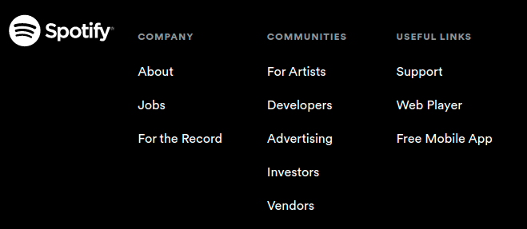
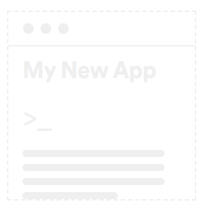
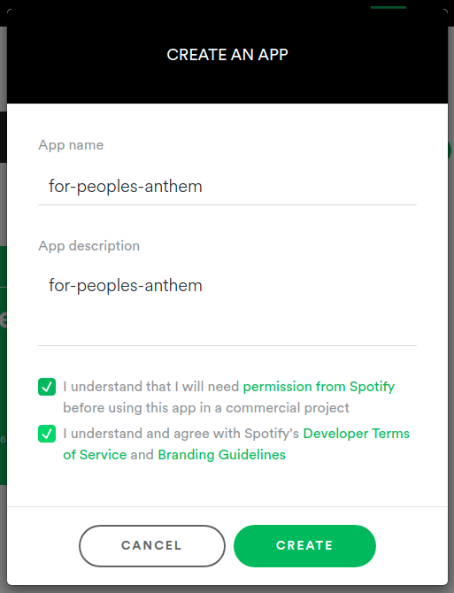
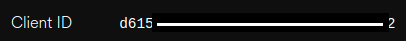
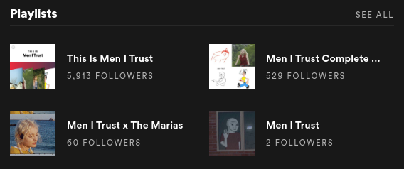
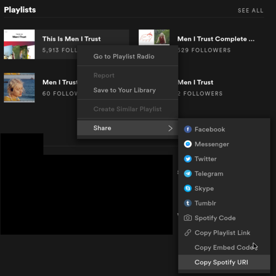

# Setting up Spotify with people's anthem
In this documentation, we review how to get the appropriate Spotify credentials so that you can play music from your playlist with `People's anthem`.

We will see:
1. What file to edit
2. How to get your Spotify `client_id`
3. How to get your Spotify `client_secret`
4. How to get your Spotify playlist URI

## 1. What file to edit
Start by opening the file `peoples-anthem/code/config.py`.

This file is used in `peoples-anthem/code/peoples_anthem.py` and its information are passed to the Spotify API's via the [Spotipy](https://spotipy.readthedocs.io/en/2.16.1/) python package.

## 2. How to get your Spotify `client_id`
In this section, we are going to get the `client_id` for each person to recognize. In the example below, the `config.py` file is configured to work for 2 people: `alice` and `bob`. 

Note: The name used here (`alice` and `bob`) must match the names of the directories in `peoples-anthem/data/train/`.

```python
SECRET = dict(
    alice=dict(client_id="alice-spotify-client-id", client_secret="alice-spotify-client-secret"),
    bob=dict(client_id="bob-spotify-client-id", client_secret="bob-spotify-client-secret"),
)
```

### 2.1 Go to https://www.spotify.com/, scroll down and click on "Developers" to get to the Developers menu


### 2.2 From there, click on _Dashboard_ and log in


### 2.3 Choose to create a new App




### 2.4 Replace `alice-spotify-client-id` by your `Client ID`


Note: If desired, `alice` and `bob` can share the same `client_id`.

## 3. How to get your Spotify `client_secret`

### 3.1 From step 2.4, click on `SHOW CLIENT SECRET` and replace `alice-spotify-client-secret` by  your `Client Secret`


Note: If desired, `alice` and `bob` can share the same `client_secret`.

Congrats! At this point you are set-up to play Spotify from `people's anthem`!

## 4. How to get your Spotify playlist URI
Before you can start going, there is one last thing to do.
We need to tell `people's anthem` what playlist to play for each person.

For this, we need to modify this section of `peoples-anthem/code/config.py`:

```python
PLAYLIST = dict(
    alice="spotify:playlist:alice",
    bob="spotify:playlist:bob",
)
```

### 4.1 Go to the Spotify app and find a good playlist


### 4.2 Right click and click on "Copy Spotify URI"



In this example, the Spotify playlist is this one: `spotify:playlist:37i9dQZF1DZ06evO24IA7u`.

### 4.3 Replace `spotify:playlist:alice` by your `Spotify URI`

```python
PLAYLIST = dict(
    alice="spotify:playlist:37i9dQZF1DZ06evO24IA7u",
    bob="spotify:playlist:34ymV2IwnxzWjILCycL0Ki",
)
```

Note: If desired, `alice` and `bob` can share the same `Spotify URI`.

Note: `People's anthem` is set up to play playlist, as opposed to artist radio, etc. Make sure that your `Spotify URI` starts with: `spotify:playlist:`.
